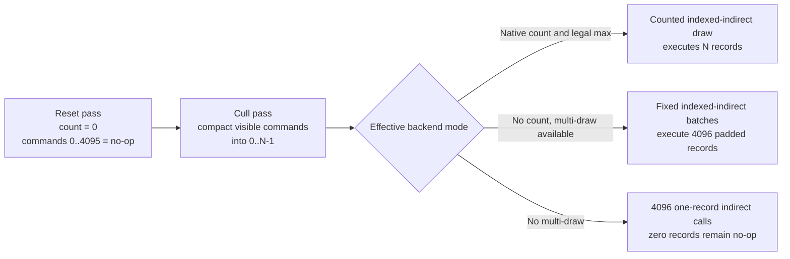

# Terrain Indirect-Count Compatibility — Implementation and Validation Record

Status: implemented and validated on available hardware

Date: 2026-08-13

Primary target: Vulkan devices that do not expose Vulkan 1.2 `drawIndirectCount` or `VK_KHR_draw_indirect_count`

Secondary target: a backend-neutral contract that maps cleanly to D3D12 and future graphics APIs

The production implementation, deterministic fallback coverage, generated shader artifacts, build matrix, desktop Vulkan graphics tests, and Android integration are complete. The connected Android emulator exposes native Vulkan 1.2 indirect-count support, so automatic selection on a genuinely count-unsupported mobile device remains a platform qualification item rather than an implementation blocker. Forced padded-multi and padded-single modes exercise those exact recorder paths on capable desktop hardware and assert exclusive backend telemetry.

## Decision summary

Terrain now renders correctly without `vkCmdDrawIndexedIndirectCount`. The implementation keeps GPU culling and the compacted visible-command prefix while making the entire indirect-command allocation valid every frame:

1. A separate GPU reset pass sets `visibleCount` to zero and clears all 4,096 indirect-command records.
2. The existing culling shader compacts live commands into `[0, visibleCount)` and leaves the cleared tail `[visibleCount, 4096)` as zero-count no-ops.
3. The backend records the counted draw natively when possible. Otherwise it executes the zero-padded range with ordinary indexed-indirect draws.
4. Ordinary indirect draws are split to respect `maxDrawIndirectCount`. If `multiDrawIndirect` is unavailable, the backend emits one indirect record per API command.
5. The public command-recorder API carries an explicit `ZERO_PADDED_TO_MAX` fallback contract. A caller that cannot prove a zero/no-op tail may require native count support instead; the backend must never silently ignore its count buffer.

This preserves the native fast path, avoids GPU-to-CPU readback, retains GPU frustum culling and LOD selection, and gives D3D12/future APIs a portable semantic operation to implement.



## Implementation and validation record

The following evidence was collected from the completed implementation:

- FluxCompiler regenerated and validated all 73 shader programs, including the terrain reset, culling, and G-buffer variants.
- Vulkan, Null, and D3D12 RenderTest configurations build successfully. The Android x86_64 AGDE build links `librendertest.so` and produces an APK containing the validation layer and required terrain shader artifacts.
- Unit counts, each observed on 2026-08-13 and labelled with the exact configuration that produced it (an unlabelled count is not reproducible — the three RenderTest configurations legitimately register different numbers of tests):
  - Null Debug Tools=True RenderTest — **1,729 ran / 1,728 passed / 0 failed / 1 skipped**. This is the number the gate pins.
  - Vulkan Debug Tools=True RenderTest — **1,766 ran / 1,764 passed / 0 failed / 2 skipped**, no VUID or validation errors.
  - Vulkan Release Tools=False RenderTest — **1,502 ran / 1,499 passed / 0 failed / 3 skipped**.
  - Null Debug Tools=True Combat (the engine gate) — **1,638 ran / 1,637 passed / 0 failed / 1 skipped**, matching the pin; Zenithmon — **3,276 ran / 3,274 passed / 0 failed / 2 skipped**, matching `-Baseline 3276`.
- The Vulkan-specific unit files (`Zenith_Vulkan_DeviceSelection.Tests.inl`, `Zenith_Vulkan_IndirectCount.Tests.inl`, `Zenith_Vulkan_AccessMapping.Tests.inl`) are hosted by `Zenith_Vulkan_CommandBuffer.cpp`, a TU that only Vulkan configurations compile. Adding a test there therefore moves **no** pinned baseline — both `run_unit_gate.ps1` sites run `Null_` executables. Only backend-neutral tests move 1638/3276.
- `TerrainIndirectCompatibility` passes three independent processes. Auto records native count only; forced padded records padded multi-draw only; forced single records padded single-draw only; every arm reports zero fail-closed requests. The test proves many → few → fully culled → many transitions, zeroes every five-word tail record, uses a terrain-only sentinel mask, and compares cropped RGB images against frozen mean, percentile, maximum, mask-XOR, and IoU limits. The wrapper also requires the three arms to be three *distinct* tiers (`auto` = `NATIVE_COUNT`, `padded` = `PADDED_MULTI`, `single` = `PADDED_SINGLE`) and fails loudly otherwise: the in-process check requires each arm to match whatever tier the selector chose, which on a device lacking usable native count legitimately yields `auto` = `PADDED_MULTI` and reduces the auto-vs-padded comparison to a fallback measured against itself on two byte-identical captures.
- The five-case RenderTest smoke matrix passes auto/native, forced padded, forced single, padded LOD plus wireframe, and procedural regeneration. Each arm verifies the requested effective tier from backend telemetry before accepting its PASS marker.
- The performance collector records per-frame terrain GPU timings, CPU command-recording timings, effective capabilities, and exact indirect-command telemetry to CSV/JSON. Canonical optimized-runtime dense-camera captures pass for auto/native, padded-multi, and padded-single; each mode uses three isolated processes with 120 warmup frames and 300 measured frames per process (900 measured samples per mode). These reports are separate from the non-budgetable developer-sanity mode.
- The Android emulator enables the Vulkan validation layer, initializes VMA, initializes all 4,096 terrain chunks, renders visible terrain, and produces a screenshot with no VUID, device-loss, fail-closed, or allocator-failure marker. This emulator exposes native core indirect-count support, so it validates Android packaging and the native automatic route, not automatic unsupported-device selection.
- Hosted CI compiles the Vulkan RenderTest target. A GPU-runner workflow runs compatibility and smoke gates and can collect the canonical performance report.

The original implementation phases below are retained as an auditable map from the initial failure to the landed architecture. Statements describing the old behavior are historical.

## Pre-implementation state and failure

The dependency is architectural, not fundamental:

- `Zenith/Flux/Terrain/Flux_Terrain.cpp` unconditionally calls `DrawIndexedIndirectCount` for each terrain.
- `Zenith/Flux/Shaders/Terrain/Flux_TerrainCulling.slang` atomically compacts visible chunks into a prefix. Culled chunks return without writing an indirect record.
- `Zenith/Flux/Shaders/Terrain/Flux_TerrainResetCounters.slang` clears only the visible counter.
- `Zenith/EntityComponent/Components/Zenith_TerrainComponent.cpp` initializes the 4,096-record argument buffer to zero only when it is created.
- `Zenith/Vulkan/Zenith_Vulkan_CommandBuffer.cpp` logs once and returns when native counted indirect is unavailable. The reset, culling, LOD, and streaming work still runs, but the terrain draw vanishes.
- `Zenith/Vulkan/Zenith_Vulkan.cpp` logs that terrain streaming is disabled, which is inaccurate: only draw submission is skipped.

A direct substitution of `DrawIndexedIndirect(..., 4096)` is incorrect today. If frame A writes many commands and frame B has fewer visible chunks, the unwritten tail still contains frame A commands and replays stale terrain. A correct fixed-count fallback therefore requires one of these data layouts:

- a compacted live prefix followed by a freshly zeroed tail; or
- a stable command slot per chunk, with every culled slot explicitly rewritten to zero.

This plan chooses the first layout because it keeps the current culling algorithm and native counted fast path. Repository history supports both designs: the original GPU terrain path in commit `34968ac9` used fixed per-chunk slots, while commit `30a73ed7` introduced compaction and counted drawing. The current shader intentionally does not sort the compacted prefix, so restoring fixed-slot behavior solely for sorting is unnecessary.

## Goals

1. Render terrain on devices missing the native indexed-indirect-count command.
2. Preserve native counted indirect on capable devices.
3. Guarantee that a fixed-max fallback cannot replay stale or uninitialized commands.
4. Keep GPU frustum culling, LOD hysteresis, HIGH-to-LOW residency fallback, and stable chunk identity unchanged.
5. Avoid all production GPU-count readback and CPU/GPU synchronization stalls.
6. Respect Vulkan `maxDrawIndirectCount` and `multiDrawIndirect` rules in the generic fixed indexed-indirect recorder.
7. Keep Flux free of Vulkan extension names, function pointers, and API-specific branches.
8. Provide a deterministic forced-fallback mode that can run on a capable desktop in CI and local validation.
9. Keep Null and the current no-op D3D12 scaffold conformant.
10. Add pixel-level proof that both native and fallback paths draw terrain, including a many-visible to few/none-visible stale-tail stress case.

## Non-goals and compatibility boundary

- This work does not create a real D3D12, Metal, OpenGL, or WebGPU backend. It defines the contract those backends must implement and updates the in-tree stubs.
- It does not lower Zenith's explicit Vulkan 1.1 / SPIR-V 1.3 renderer minimum. Descriptor indexing, bindless textures, texture formats, graphics+compute queue support, and other engine minimums remain separate device-suitability concerns.
- Terrain currently uses a non-zero indirect `firstInstance` to carry `chunkIndex`, and both G-buffer vertex shaders consume `SV_StartInstanceLocation`. This plan keeps `drawIndirectFirstInstance` and shader draw parameters as an explicit terrain minimum. A follow-on design for devices missing those features appears later in this document, but it is not required to remove the indirect-*count* dependency.
- The implementation will not use same-frame or previous-frame visible-count readback. Same-frame readback stalls; a previous-frame count is wrong when visibility shrinks and still needs a zero tail, making the readback redundant.
- The implementation will not collapse reset into thread 0 of the culling dispatch. There is no device-wide barrier across culling workgroups inside one dispatch.
- The implementation will not remove the counted command method from the command-recorder concept. Counted drawing remains a useful semantic operation even when a backend emulates it.

## Required invariants

These are release-blocking contracts, not implementation suggestions.

### Indirect-command ABI

An indexed-indirect record is exactly five 32-bit words and 20 bytes:

| Word | Type | Meaning |
|---|---|---|
| 0 | `uint32_t` | index count |
| 1 | `uint32_t` | instance count |
| 2 | `uint32_t` | first index |
| 3 | `int32_t` | vertex offset |
| 4 | `uint32_t` | first instance |

The C++ and Slang representations must be pinned with a 20-byte assertion/test. Replace terrain's literal stride `20` with a named constant derived from that contract.

### Live-command contract

For every visible chunk with usable geometry, culling writes one complete record into the compacted prefix:

```text
indexCount    = selected resident LOD index count
instanceCount = 1
firstIndex    = selected resident LOD first index
vertexOffset  = selected resident LOD vertex offset
firstInstance = stable chunk index
```

The culling shader must preserve its current rules:

- frustum rejection produces no live record;
- the requested LOD uses the prior-frame LOD inside the existing ±1% hysteresis band;
- missing HIGH geometry falls back to LOW;
- a chunk with both LOD index counts equal to zero is skipped;
- `LODLevelBuffer[chunkIndex]` records the LOD that actually drew;
- `visibleCount` never exceeds `TOTAL_CHUNKS`.

### Padded-tail contract

Before culling starts, every record in `[0, TOTAL_CHUNKS)` has all five words set to zero. After culling:

- `[0, visibleCount)` contains complete live records;
- `[visibleCount, TOTAL_CHUNKS)` remains all-zero no-op records;
- an ordinary fixed draw over the entire range is therefore valid even when visibility falls to zero.

The command API must make this promise explicit. A suitable neutral enum is:

```cpp
enum class Flux_IndirectCountFallback : uint8_t
{
	REQUIRE_NATIVE,
	ZERO_PADDED_TO_MAX
};
```

`DrawIndexedIndirectCount` gains this required policy argument. Terrain passes `ZERO_PADDED_TO_MAX`. `REQUIRE_NATIVE` asserts/logs a hard error if native count is unavailable or the request cannot legally use the native command; it must not execute a fixed range.

### Synchronization contract

The render graph must prove these edges for each persistent per-terrain buffer:

| Producer | Consumer | Resource/access transition |
|---|---|---|
| Previous frame G-buffer | Current frame reset | indirect read → UAV write, via cyclic persistent-buffer seed |
| Reset | Culling | UAV write → UAV write for count and arguments |
| Culling | G-buffer | UAV write → indirect-argument read for arguments and count |
| Culling | G-buffer | LOD read/write UAV → vertex-stage SRV read |

The count buffer can remain conservatively declared as an indirect-argument read in fallback mode even though the fixed draw ignores it. This keeps a stable graph shape and costs no meaningful work.

## Backend-neutral API design

### New leaf header

Add `Zenith/Flux/Backend/Flux_IndirectDraw.h` as a dependency-light header containing:

- `Flux_IndirectCountFallback`;
- `Flux_IndirectExecutionMode` with `NATIVE_COUNT`, `PADDED_MULTI`, and `PADDED_SINGLE`;
- `Flux_IndirectDrawCapabilities`;
- `Flux_IndirectDrawOverride` with `AUTO`, `NATIVE`, `PADDED`, and `SINGLE`;
- a pure mode selector;
- a pure fixed-draw batch planner;
- shared validation helpers for offset/stride/count arithmetic where practical.

Suggested capability fields:

```cpp
struct Flux_IndirectDrawCapabilities
{
	bool     m_bNativeIndexedIndirectCount = false;
	bool     m_bMultiDrawIndirect          = false;
	bool     m_bIndirectFirstInstance      = false;
	bool     m_bShaderDrawParameters       = false;
	uint32_t m_uMaxDrawIndirectCount       = 1;
};
```

These are graphics semantics, not Vulkan names. In each backend, keep advertised hardware support, the route enabled at device creation, and usable native support (`enabled && entry point resolved`) as distinct diagnostic state. Expose the usable semantic capability above, and log all three where they differ. The override changes effective mode but never falsifies hardware or usable fields.

### Mode selection

For a request with `uMaxDrawCount` and a fallback policy:

1. Select `NATIVE_COUNT` only when native count is enabled, its function/entry point is valid, the request is within the backend's reported native limit, and the override permits it. `multiDrawIndirect` gates fixed `vkCmdDraw[Indexed]Indirect` commands only; it does not gate `vkCmdDraw[Indexed]IndirectCount`.
2. Otherwise, if policy is `ZERO_PADDED_TO_MAX` and multi-draw is available, select `PADDED_MULTI`.
3. Otherwise, if policy is `ZERO_PADDED_TO_MAX`, select `PADDED_SINGLE`.
4. Otherwise fail closed because `REQUIRE_NATIVE` was requested.

If a native counted request exceeds `maxDrawIndirectCount`, do not split it against the same global count buffer: each batch would reread the full count and overdraw. Select padded fixed batches instead when the caller permits them.

The fixed batch planner takes an explicit per-call limit and produces `(offset, drawCount)` batches such that:

- every batch count is at least one and no greater than the effective limit;
- the batches cover every requested record exactly once;
- offsets advance by `batchDrawCount * stride` with overflow checks;
- `PADDED_SINGLE` produces `drawCount == 1` for every batch;
- `uDrawCount == 0` produces no API command.

For an ordinary public fixed draw, the per-call limit is `maxDrawIndirectCount` when multi-draw is enabled and one otherwise. For an emulated counted draw, `PADDED_MULTI` uses the same limit and `PADDED_SINGLE` explicitly uses one. Keep that resolved limit in a private/common fixed-emission helper; a forced single counted draw must not turn unrelated public fixed draws into single-record loops.

An explicit `NATIVE` override is a test assertion, not a preference: if any native precondition fails, mode selection fails closed rather than silently choosing padded execution. `AUTO` may choose the lower legal tier.

The `--indirect-count-mode` override applies to semantic counted-draw requests only. It must not globally turn independent ordinary `DrawIndexedIndirect` callers into single-record loops; those callers follow their own request plus the device's legal fixed-draw limit.

### Device concept

Extend `FluxBackendDevice` in `Zenith/Flux/Backend/Concepts/Flux_Concept_Device.h` with:

```cpp
Flux_IndirectDrawCapabilities GetIndirectDrawCapabilities() const;
```

Implement it in Vulkan, Null, and D3D12. Returning the small record by value avoids a lifetime contract; if implementation instead returns `const&`, each backend must own stable device-lifetime storage and never return a temporary. Include `Flux/Backend/Flux_IndirectDraw.h` explicitly from every concept/backend header that names these types. This surface is primarily for diagnostics, tests, device policy, and future feature selection. Terrain still uses the semantic command-recorder operation rather than inspecting Vulkan-specific state.

The Null and current no-op D3D12 scaffold should report conservative capabilities (`native count = false`, `multi-draw = false`, `max = 1`). Their recorder calls remain no-ops, so this exercises portable policy/conformance without pretending those backends provide runtime graphics evidence.

### Command-recorder concept

Keep both fixed and counted methods in `FluxBackendIndirectDraws`, but update the counted signature and prose:

```cpp
void DrawIndexedIndirectCount(
	const Flux_IndirectBuffer* pxArguments,
	const Flux_IndirectBuffer* pxCount,
	uint32_t uMaxDrawCount,
	Flux_IndirectCountFallback eFallback,
	uint32_t uArgumentsOffset,
	uint32_t uCountOffset,
	uint32_t uStride);
```

Place the required policy before any defaulted offset/stride parameters, or remove those defaults from this overload. Appending a required parameter after today's defaulted parameters is ill-formed C++.

The operation means “use the count buffer natively when legal; otherwise use only the caller-authorized fallback.” It does not mean every backend must expose a hardware count-buffer command. Update Vulkan, Null, and D3D12 declarations and the conformance tests together.

The ordinary `DrawIndexedIndirect` method must also use the batch planner. That hardening benefits existing grass, particles, instanced meshes, and unified-mesh callers and ensures no caller can exceed a backend limit accidentally. Splitting one multi-draw into several API commands resets shader draw ID for each batch; before applying this globally, source-pin/assert that no affected current shader consumes draw ID across the original logical call. A caller that needs continuous draw ID requires an explicit base or a different submission contract. Because this broadens the change beyond terrain, add at least one Vulkan validation/runtime smoke scene covering GPU particles, grass, and unified/instanced meshes in native auto mode and with forced single counted emulation enabled. If that coverage or DrawID proof cannot land with this work, keep the spec-safe fixed emitter private to counted fallback first and move generic fixed-call hardening to a separately tested change.

## Detailed implementation phases

### Phase 0 — Baseline and deterministic reproduction

Before changing behavior:

1. Record a capable desktop's Vulkan device/capability log, a deterministic terrain screenshot, and terrain GPU timings.
2. Reproduce the current unsupported behavior on the Android x86_64 emulator or with a temporary local force seam: reset/cull/streaming run, counted draw is skipped, and terrain is absent.
3. Save baseline artifacts under `Build/artifacts/`; do not add captures or logs to source control.
4. Confirm the worktree is clean and preserve unrelated user changes throughout implementation.

Pass gate: there is evidence of both the healthy native path and the specific missing-count failure before the fix.

### Phase 1 — Pure policy, command ABI, and command-line override

Files:

- add `Zenith/Flux/Backend/Flux_IndirectDraw.h`;
- update `Zenith/Flux/Backend/Concepts/Flux_Concept_Device.h`;
- update `Zenith/Flux/Backend/Concepts/Flux_Concept_CommandRecorder.h`;
- update `Zenith/Flux/Backend/Flux_BackendConformance.cpp` if explicit assertions or includes are needed;
- update `Zenith/Core/Zenith_CommandLine.h/.cpp` and `Zenith/Core/Zenith_CommandLine.Tests.inl`.

Implement the Flux types and pure selection/batching functions described above. Core must not include or return a Flux type: `Zenith_CommandLine` owns a small string/enum representation for the launch option, and Vulkan/Flux converts that value into `Flux_IndirectDrawOverride` during backend initialization. Add an early process flag:

```text
--indirect-count-mode=auto|native|padded|single
```

Rules:

- `auto` is the shipping default;
- `native` is accepted only if the hardware/driver path is truly valid and the request fits the limit;
- `padded` forbids native count; it selects padded multi when available and otherwise the legal padded-single tier;
- `single` forces one-record fixed calls and is intended for diagnostics/CI;
- an unsupported upward force fails closed with a clear error; it never calls a null function pointer;
- logs show raw capability, override, and effective mode separately.

Use the boot-time override for shipping diagnostics because it is deterministic and safe for worker command recording. Use two separate processes for the graphics A/B gate: one `auto`/native invocation and one `padded` invocation write independently named artifacts, and a harness compares them after both processes finish. Do not mutate backend mode while worker recording is live. If a future in-process override is added, it must be main-thread-only, transition at a frame/graph boundary, restore in teardown, and request a graph rebuild if reset-pipeline selection ever becomes mode-dependent.

Unit-test at least:

- Vulkan 1.2/core count available;
- KHR count available on a pre-1.2 device;
- advertised feature but unresolved/null entry point;
- no count extension/feature;
- request greater than the native max;
- forced padded and forced single on capable hardware data;
- forced native on unsupported data fails closed;
- multi-draw unavailable selects single;
- count available but multi-draw unavailable can still select native within the reported native limit, while fixed emission remains single-record;
- forced padded without multi-draw selects single, while forced native with any failed native precondition fails closed;
- batch sizes of 1, 64, 4,095, 4,096, and a non-divisible final batch;
- last-record byte offset and integer-overflow rejection.

The neutral selector receives usable semantic booleans and therefore cannot distinguish Vulkan core 1.2 from the KHR route. Add a small Vulkan-specific negotiation helper with synthetic API-version, feature, extension, and entry-point inputs to test core, KHR, advertised-but-null, and unsupported cases. Keep neutral selector tests focused on usable native support, multi-draw, limits, policy, and overrides.

### Phase 2 — Pin terrain's indirect data contract

Files:

- update `Zenith/Flux/Terrain/Flux_TerrainGPUStructs.h` or add a small terrain indirect-contract header;
- update `Zenith/EntityComponent/Components/Zenith_TerrainComponent.cpp`;
- add `Zenith/Flux/Shaders/Terrain/Flux_TerrainIndirectCommon.slang`;
- update `Zenith/Flux/Shaders/Terrain/Flux_TerrainCulling.slang`;
- extend `Zenith/Flux/Terrain/Flux_Terrain.Tests.inl`.

Add a C++ terrain indexed-indirect POD with the exact five fields and `static_assert(sizeof(...) == 20)`. Add named word-count, byte-stride, record-count, and buffer-size constants. Where an existing shared Flux indirect constant can be reused without creating a layering edge, use it rather than inventing a conflicting global type.

Replace `Zenith_TerrainComponent.cpp`'s hard-coded `sizeof(uint32_t) * 5 * TOTAL_CHUNKS` allocation/seed sizing with those named ABI constants. The real allocation must be governed by the same contract the tests pin.

Move the Slang `DrawIndexedIndirectCommand` declaration out of the culling shader into the new terrain-local include so reset and culling share one definition. Keep the signed `vertexOffset` field.

Add pure poison-filled tests for the C++ ABI/zero-record helper that verify:

- zeroing a record writes all five words;
- a live record has `{indexCount, 1, firstIndex, vertexOffset, chunkIndex}`;
- `TOTAL_CHUNKS * stride` matches the allocated byte size;
- the final record ends exactly at the allocation boundary;
- the last record and buffer arithmetic stay in range.

Do not make a C++ helper exist solely to imitate the shader unless it also defines a real shared ABI/validation contract. A narrowly scoped source invariant test is acceptable for shader behavior reflection cannot expose, following the bounded-source pattern in the particle GPU tests. The production stale-tail proof is the graphics-required full-buffer readback in Phase 7; a simulated vector cannot prove the reset shader ran.

### Phase 3 — Clear the complete argument range on the GPU

Files:

- update `Zenith/Flux/Shaders/Terrain/Flux_TerrainResetCounters.slang`;
- update `Zenith/Flux/Terrain/Flux_Terrain.cpp`;
- regenerate terrain shader artifacts and `Zenith/Flux/Shaders/Generated/Terrain.h`.

Reset shader changes:

1. Add the indirect command buffer to `PassParams` as an RW structured buffer using the shared command type.
2. Change to `[numthreads(64, 1, 1)]` and accept `SV_DispatchThreadID`.
3. Thread zero writes `visibleCount[0] = 0`.
4. Each in-range thread writes one fully zero-initialized command.
5. Query command-buffer dimensions and bounds-check rather than embedding 4,096 in the shader.

Render-graph changes in `Flux_TerrainImpl::SetupRenderGraph`:

- rename/comment the pass as resetting count and indirect arguments;
- declare `m_xVisibleCountBuffer` and `m_xIndirectDrawBuffer` as reset-pass UAV writes;
- retain the explicit reset → culling dependency;
- retain culling UAV writes for arguments/count and read-write access for LOD state;
- retain G-buffer indirect reads for arguments/count and SRV read for LOD.

Recording changes in `ExecuteResetCounters`:

- bind both generated UAV handles by name;
- dispatch `ceil(TOTAL_CHUNKS / 64)` groups, currently 64;
- do not clear `LODLevelBuffer`, because it is prior-frame hysteresis state.

The separate reset pass is mandatory. Its graph boundary supplies the cross-workgroup visibility needed before culling atomics run.

Regenerate checked-in artifacts with the canonical Tools=True FluxCompiler. Expected changes include the reset SPIR-V, reflection, and generated Terrain binding header. Do not hand-edit generated files.

### Phase 4 — Vulkan capability negotiation and spec-safe fixed draws

Files:

- update `Zenith/Vulkan/Zenith_Vulkan.h`;
- update `Zenith/Vulkan/Zenith_Vulkan.cpp`;
- update `Zenith/Vulkan/Zenith_Vulkan_CommandBuffer.h/.cpp`.

Device initialization must collect and store:

- native core/KHR indexed-indirect-count availability;
- successful resolution of exactly the enabled core or KHR command alias;
- `multiDrawIndirect` availability/enabled state;
- `drawIndirectFirstInstance` availability/enabled state;
- shader draw-parameters availability/enabled state;
- `VkPhysicalDeviceLimits::maxDrawIndirectCount`.

Count support is optional and must never reject an otherwise suitable adapter. Resolve a function pointer only for the route actually enabled. A null pointer after advertised support downgrades raw native-count support and logs the broken-driver condition; it must not be called.

Make `multiDrawIndirect` optional for this command path: enable it only when advertised. Keep `drawIndirectFirstInstance` and shader draw parameters as explicit required terrain features for this plan. Do not silently force unsupported feature bits to `VK_TRUE` in `vkCreateDevice`.

Make physical-device selection skip adapters that lack any existing hard renderer requirement, including the documented remaining terrain minimum (`drawIndirectFirstInstance` and shader draw parameters), and fail cleanly before `vkCreateDevice` if none is suitable. Score suitable adapters normally; absence of count or multi-draw is only a performance downgrade. Do not turn this scoped change into an unreviewed rewrite of unrelated Vulkan policy, but do not retain the current invalid “pick first, force unsupported feature bits” behavior.

Because that selection now resolves presentation through a shared routine that may pick a family of its own, `CreateCommandPools` must not create a pool for a separate presentation-only family. Presentation is not a command-buffer capability: `vkQueuePresentKHR` takes no command buffer, and a family selected purely on `vkGetPhysicalDeviceSurfaceSupportKHR` may expose none of graphics/compute/transfer. Skip `COMMANDTYPE_PRESENT` unless it resolved to the graphics family, and assert in the pool getter rather than returning a null handle. No caller needs it — the pool accessors are reached only with GRAPHICS and COPY.

Implement `DrawIndexedIndirect` and a private/common fixed-emission helper as follows:

1. Flush descriptors once.
2. Resolve and validate the argument buffer once.
3. Validate stride, alignment, requested range, and overflow.
4. In multi-draw mode, emit fixed batches no larger than `maxDrawIndirectCount`. The fixed per-call limit is one when `multiDrawIndirect` is disabled, regardless of the raw physical-device limit; this fixed-only clamp must not downgrade native counted draws.
5. Without multi-draw, emit one `drawIndexedIndirect` call per record with `drawCount = 1` and an offset advanced by `stride`.

Implement `DrawIndexedIndirectCount` as follows:

1. Select and validate an effective mode from raw capabilities, request size, override, and fallback policy before flushing descriptors or resolving buffers.
2. In `NATIVE_COUNT`, flush once, resolve both buffers once, and call the enabled core/KHR function exactly once.
3. In `PADDED_MULTI` or `PADDED_SINGLE`, do not resolve or dereference the count buffer; invoke the common fixed emitter over `uMaxDrawCount` records with, respectively, the device's legal multi-draw limit or a per-call limit of one.
4. In a disallowed fallback, assert/log a hard failure and emit no draw.
5. Log effective fallback at device initialization where possible. Any first-use diagnostic reachable from parallel record workers must use per-device atomic/once synchronization, not an unsynchronized function-static boolean.

Correct the startup and recorder messages. They must say whether hardware count exists and which effective fallback is selected; no message may claim streaming is disabled.

### Phase 5 — Terrain call site and backend stubs

Files:

- update `Zenith/Flux/Terrain/Flux_Terrain.cpp`;
- update `Zenith/Null/Zenith_Null.h` and `Zenith/Null/Zenith_Null_CommandBuffer.h`;
- update `Zenith/D3D12/Zenith_D3D12.h` and `Zenith/D3D12/Zenith_D3D12_CommandBuffer.h`.

At the terrain draw site:

- keep one semantic `DrawIndexedIndirectCount` call;
- pass `TOTAL_CHUNKS`, named zero offsets, the named 20-byte stride, and `ZERO_PADDED_TO_MAX`;
- fix the comments that currently claim commands are front-to-back sorted; the shader uses atomic append order and intentionally omits sorting;
- preserve the per-terrain LOD SRV, vertex/index buffers, materials, splatmap, and draw constants exactly.

Update Null/D3D12 getters and method signatures so all backend concepts compile. Do not present a D3D12 no-op build as runtime rendering proof.

### Phase 6 — Render-graph and backend policy verification

Files:

- extend the barrier tests in `Zenith/Core/Zenith_UnitTests.Tests.inl` or add a focused render-graph test beside the existing terrain indirect-argument coverage;
- extend `Zenith/Flux/Terrain/Flux_Terrain.Tests.inl`;
- add focused tests for the new neutral policy/header in the module-appropriate test file.

Required barrier assertions:

- reset count write → culling count write is UAV WAW;
- reset argument write → culling argument write is UAV WAW;
- culling argument write → G-buffer indirect read targets draw-indirect access/stage;
- culling count write → counted G-buffer indirect read remains correct;
- culling LOD read/write → G-buffer LOD SRV read is correct;
- prior-frame G-buffer argument read → next-frame reset argument write is represented by the cyclic seed;
- prior-frame conservative count indirect read → next-frame count reset write is represented by the cyclic seed.

Backend-neutral render-graph tests assert the access transitions above, including `WRITE_UAV -> READ_INDIRECT_ARG`. A separate Vulkan access-mapping test must assert that `READ_INDIRECT_ARG` maps to `eIndirectCommandRead` at `eDrawIndirect`; do not infer native stage/access values from the neutral graph test.

Generic access-transition tests are necessary but cannot prove the declarations in `Flux_Terrain.cpp`. Factor the per-terrain resource declarations into a small inspectable helper used by `SetupRenderGraph`, or add a bounded terrain graph-shape/source invariant test alongside the generic barrier tests. The gate must fail if terrain's reset pass stops declaring either arguments or count as UAV writes.

Required policy/recording proof:

- auto/capable selects one native counted call;
- forced padded selects fixed batches and zero native counted calls;
- forced single selects only `drawCount == 1` fixed calls;
- an `AUTO` request over the native limit uses authorized padded fixed batches rather than incorrectly splitting one count buffer; an explicitly forced `NATIVE` request fails closed;
- descriptor updates and buffer validation occur once per semantic draw request, not once per record.

Current command buffers are concrete aliases with non-virtual methods, so there is no ready-made spy. Make the immutable execution plan returned by the pure selector/batch planner the primary unit-test seam. Add narrowly scoped `ZENITH_TESTING` per-device recorder counters only if the integration gate must prove native versus fixed API emission and descriptor-update count; keep them atomic and outside shipping builds. Do not make pixel equality the only evidence that the intended API path ran.

### Phase 7 — Deterministic graphics regression test

Add a RenderTest automated test marked `m_bRequiresGraphics = true`, following the existing screenshot/capture infrastructure in `Games/RenderTest/Tests/TAATemporalStability.cpp`. Regenerate projects after adding the `.cpp`, then assert `--list-automated-tests` contains the new test name. Null must list and skip it because it requires graphics; unsupported Vulkan must run it in auto/fallback mode rather than skip.

Test setup:

- use a fixed terrain-dominated camera and deterministic scene state;
- disable TAA/temporal noise for the comparison, or measure same-mode temporal noise explicitly;
- run native/auto and forced-padded captures in separate process invocations on a capable device, using an identical fixed camera/frame schedule and distinct artifact/result paths;
- on a genuinely unsupported device, run the padded capture and non-vacuity gate even though native A/B is unavailable;
- save native and fallback captures on failure. Add a small test/harness image writer before requiring an on-disk difference image; the current TGA helper is reader-oriented and the screenshot service accepts only one pending capture, so schedule captures sequentially.

The test must have two independent gates:

1. **Non-vacuity:** the test first asserts a non-zero visible count through a test-cadence buffer readback, then classifies a predeclared inset crop rendered with a test-only flat/sentinel terrain debug colour and requires a frozen minimum pixel coverage. Define the colour tolerance, crop, and coverage from the native baseline before landing. This prevents native and fallback from both passing with a blank image.
2. **Equivalence:** compare matched native and fallback captures with frozen mean, p99.9, and maximum RGB-delta budgets inside the terrain viewport crop. Also compare the terrain-only sentinel masks with a frozen symmetric-difference ceiling and IoU floor; this directly gates silhouette holes/ghosts that whole-crop statistics can dilute. Measure native-reference temporal noise in the baseline phase only; freeze and cap every tolerance in the test data. Never derive a passing threshold from the fallback candidate under test.

Stale-tail stress sequence:

1. settle at a pose with many visible chunks;
2. move to a pose with few visible chunks;
3. use a deterministic cull-all test hook or camera pose whose read-back visible count is asserted to equal zero;
4. return to the original pose;
5. repeat under LOD debug and wireframe where practical;
6. include a HIGH-not-resident case only after adding a test-only eviction/residency seam and asserting HIGH is absent before capture; otherwise cover that invariant through existing streaming state plus indirect-buffer readback, not an unprovable screenshot precondition.

Pass gate: no ghost chunks, holes, device loss, validation errors, or native/fallback coverage drift.

At a settled test cadence, use the existing slow `DownloadBufferData` path to read the count and all 4,096 command records in test code only. Assert the live prefix contains structurally valid commands and every tail record has all five words zero across many → few → zero transitions. Production code must never use this readback.

### Phase 8 — Smoke, Android, and performance rollout

Keep graphics evidence separate from the existing resource/streaming smoke: `RunRenderTestSmoke.ps1` does not invoke an automated graphics test or produce a screenshot. The dedicated wrapper launches the graphics test in three fresh processes (`auto`, `padded`, then `single`), uses unique result/capture paths, asserts the test is present, `passed: true`, and `skipped: false`, and then compares artifacts. The ordinary smoke matrix includes forced-mode resource cases without requiring a nonexistent screenshot; those cases prove the requested/effective tier through an exact runtime telemetry marker rather than trusting the launch flag alone.

Both the dedicated graphics wrapper and any extended `Games/RenderTest/RunRenderTestSmoke.ps1` / `RunRenderTestSmokeMatrix.ps1` cases must hard-fail on:

- `VK ERROR`;
- `VUID-`;
- validation or synchronization-validation errors;
- asserts, device loss, or indirect-buffer bounds errors;
- the retired “terrain will not render/streaming disabled” warning;
- a missing or invalid screenshot artifact in the dedicated graphics wrapper;
- an automated-test result that is missing, failed, or unexpectedly skipped.

Do not treat a smoke PASS marker as sufficient after an unexpected non-zero process exit. Preserve only an explicitly documented known shutdown/watchdog disposition; otherwise require process success and valid result JSON. Keep retry logs per-attempt, and scan a killed timeout attempt for hard markers before retrying so its validation evidence cannot be overwritten by a later success.

Minimum desktop matrix:

- auto/native baseline;
- forced padded baseline;
- forced single baseline;
- forced padded with LOD debug + wireframe;
- procedural terrain regeneration once, unless the mode is proven not to affect it.

Build/link matrix:

- Vulkan Debug Tools=True and Tools=False;
- Null Debug with the full engine unit suite;
- D3D12 scaffold link/conformance proof;
- canonical FluxCompiler/shader validation.

Android matrix:

- AGDE x86_64 Debug on an emulator, recording whether it exposes native indirect count;
- validation layer and logcat capture using `Zenith/Android/CLAUDE.md`;
- screenshot/non-vacuity proof, camera movement, pause/resume, and several hundred frames;
- a physical count-unsupported device when available;
- one capable device to prove auto still selects native count.

Android currently never calls `Zenith_CommandLine::Parse`, so it validates automatic capability selection only. Do not claim the desktop CLI can force Android modes unless Android argument/config plumbing is implemented as a separate step. Record whether standard validation and synchronization validation were actually enabled; if validation-features support is absent, label the evidence standard-validation-only rather than overstating it.

Performance protocol:

- capture before/after on the same capable desktop plus forced padded/single;
- warm for at least 120 frames, sample at least 300 frames, and repeat three times;
- measure dense terrain, sparse/horizon, and mostly culled views;
- add a bounded steady-state collector that exports JSON and CSV under `Build/artifacts/rendertest/terrain_indirect/performance/`, then record median and p95 for terrain reset, culling, G-buffer, total GPU, CPU command recording, and emitted API command count;
- do not use emulator timings for a performance gate;
- keep recorder telemetry off the per-record path. `ZENITH_TESTING` is compiled into every current engine configuration, including optimized Tools=False, so a naive `fetch_add` beside each emitted API call costs one atomic per record — up to 4,096 per terrain per frame in `PADDED_SINGLE`, which is measured *as if* it were the tier's cost and corrupts exactly the report this protocol produces. Accumulate into a local and pay one relaxed atomic per semantic request; the emitted-call totals stay exact.

Define the artifact schema before measurement: hardware/driver/API version, raw and effective capabilities, mode, scene/camera case, warm-up/sample counts, per-pass samples grouped by exact render-graph pass name, total GPU samples, CPU recording samples, and native/fixed API command counters. The existing profiler exposes the latest pass list; it does not itself aggregate 300 frames, so this collector is implementation work rather than a documentation-only command.

Implemented collector: `TerrainIndirectPerformance` is an explicitly selected,
manual-only RenderTest automated test, driven by
`Games/RenderTest/RunTerrainIndirectPerformance.ps1`. The wrapper defaults to
optimized Vulkan Release Tools=False, enforces the 120/300/3 floor, runs each
repeat in a fresh process, and publishes raw/combined CSV plus per-repeat and
aggregate median/p95 JSON under
`Build/artifacts/rendertest/terrain_indirect/performance/`. It rejects stale GPU
capture serials, missing pass/CPU-label samples, empty totals, failed/skipped
result JSON, non-zero exits, validation/device-loss/assert markers, and telemetry
that contradicts the requested tier. `-DeveloperSanity` may lower the floor only
for a non-budgetable pipeline check; Debug, Tools=True, custom, and sanity
artifacts are explicitly classified diagnostic.

Provisional budgets, to be ratified against baseline noise before rollout:

- capable auto total GPU median regression no greater than `max(5%, 0.2 ms)`;
- capable auto p95 regression no greater than `max(10%, 0.5 ms)`;
- forced padded p95 added cost no greater than 1.0 ms on the selected target device and still within its frame budget;
- forced single is a correctness tier; record its cost and define a supported-device budget before enabling it as a marketed configuration.

If universal 80 KiB argument clearing per terrain causes a native-path regression outside the ratified budget, add two reset programs/pipelines: the existing count-only reset for requests guaranteed to use native count, and count-plus-command reset for padded-capable requests. Select the immutable reset mode at graph build from the neutral capability/policy object. Do not weaken the zero-tail invariant to save bandwidth.

## Shader artifact regeneration

The reset shader change requires a canonical Tools=True regeneration. Follow `.github/workflows/shader-validation.yml`:

```powershell
Build\regen.ps1
msbuild Build\zenith_engine_win64.sln /t:FluxCompiler /p:Configuration=Vulkan_vs2022_Release_Win64_True /p:Platform=x64 -maxCpuCount
FluxCompiler\output\win64\vulkan_vs2022_release_win64_true\fluxcompiler.exe
git status --porcelain --untracked-files=all -- Zenith/Flux/Shaders Games/*/Shaders
```

Copy the required Slang runtime DLLs beside `fluxcompiler.exe` if the local build has not already done so. Commit all generated `.spv`, `.spv.refl`, and `Generated/Terrain.h` changes produced by the canonical tool; never hand-edit them.

## Canonical verification commands

Use the generated per-game solution and build only the `RenderTest` target:

```powershell
Build\regen.ps1

msbuild Games\RenderTest\rendertest_win64.sln /t:RenderTest /p:Configuration=Vulkan_vs2022_Debug_Win64_True /p:Platform=x64 -maxCpuCount
msbuild Games\RenderTest\rendertest_win64.sln /t:RenderTest /p:Configuration=Vulkan_vs2022_Debug_Win64_False /p:Platform=x64 -maxCpuCount
msbuild Games\RenderTest\rendertest_win64.sln /t:RenderTest /p:Configuration=Null_vs2022_Debug_Win64_True /p:Platform=x64 -maxCpuCount
msbuild Games\RenderTest\rendertest_win64.sln /t:RenderTest /p:Configuration=D3D12_vs2022_Debug_Win64_False /p:Platform=x64 -maxCpuCount
```

After naming the new automated test `TerrainIndirectCompatibility`, prove discovery and run the dedicated three-process (`auto`, `padded`, `single`) wrapper the implementation adds:

```powershell
$xExe = "Games\RenderTest\Build\output\win64\vulkan_vs2022_debug_win64_true\rendertest.exe"
& $xExe --list-automated-tests --skip-unit-tests --skip-tool-exports
Games\RenderTest\RunTerrainIndirectCompatibility.ps1 -NoBuild
Games\RenderTest\RunTerrainIndirectPerformance.ps1 -Mode auto -CameraCase dense
Games\RenderTest\RunRenderTestSmokeMatrix.ps1 -NoBuild
```

Run the exact engine unit gate against the built Null executable, then update every baseline pin only from the observed completed count:

```powershell
Tools\run_unit_gate.ps1 -Exe Games\RenderTest\Build\output\win64\null_vs2022_debug_win64_true\rendertest.exe
```

The implementation must also run the canonical shader regeneration above, relevant repository layering/complexity gates, Vulkan validation/synchronization validation, and the Android workflow in `Zenith/Android/CLAUDE.md`. If local hardware cannot supply a required graphics/device result, report that evidence as unverified rather than marking the phase complete.

## File-by-file change map

| Area | Files | Required change |
|---|---|---|
| Neutral policy | `Zenith/Flux/Backend/Flux_IndirectDraw.h` | capabilities, fallback policy, override, mode selector, batch planner |
| Concepts | `Zenith/Flux/Backend/Concepts/Flux_Concept_Device.h`, `Flux_Concept_CommandRecorder.h`, `Flux_BackendConformance.cpp` | capability getter and semantic counted-draw signature |
| CLI | `Zenith/Core/Zenith_CommandLine.h/.cpp`, tests | parse a Core-owned launch-option enum/string; convert to Flux policy at backend init |
| Terrain ABI | `Zenith/Flux/Terrain/Flux_TerrainGPUStructs.h` or focused new header | five-word POD, stride/buffer constants, assertions |
| Terrain allocation | `Zenith/EntityComponent/Components/Zenith_TerrainComponent.cpp` | size and seed the real command buffer from the shared ABI constants |
| Terrain shaders | `Flux_TerrainIndirectCommon.slang`, `Flux_TerrainResetCounters.slang`, `Flux_TerrainCulling.slang` | shared ABI, full reset, unchanged compaction semantics |
| Terrain graph/draw | `Zenith/Flux/Terrain/Flux_Terrain.cpp`, possibly `Flux_TerrainImpl.h` | declare/bind reset args, dispatch 64 groups, explicit padded policy |
| Generated shaders | reset `.spv`, `.spv.refl`, `Zenith/Flux/Shaders/Generated/Terrain.h` | canonical regeneration only |
| Vulkan device | `Zenith/Vulkan/Zenith_Vulkan.h/.cpp` | raw capabilities, optional count/multi-draw negotiation, max limit, truthful logs |
| Vulkan recorder | `Zenith/Vulkan/Zenith_Vulkan_CommandBuffer.h/.cpp` | semantic selection, native count, padded batching, single loop, validation |
| Stub backends | `Zenith/Null/*`, `Zenith/D3D12/*` | getter and signature conformance |
| Unit tests | `Zenith/Flux/Terrain/Flux_Terrain.Tests.inl`, `Zenith/Core/Zenith_UnitTests.Tests.inl`, CLI tests | ABI, policy, batching, stale tail, barriers |
| Graphics tests | `Games/RenderTest/Tests/TerrainIndirectCompatibility.cpp`, `Games/RenderTest/RunTerrainIndirectCompatibility.ps1`, smoke scripts/matrix | discovery, terrain-sentinel non-vacuity, three-process A/B, read-back tail proof, transitions, forced modes |
| Documentation | terrain, Flux, Vulkan, Android, RenderTest `CLAUDE.md` files | architecture, mode flag, logs, validation workflow |

The implementation agent must verify exact generated artifact names and current test ownership before editing; the map identifies responsibilities, not permission to duplicate an existing abstraction.

## Cross-API mapping

The neutral semantic maps as follows:

### Vulkan

- Native: `vkCmdDrawIndexedIndirectCount` or `vkCmdDrawIndexedIndirectCountKHR`.
- Padded multi: `vkCmdDrawIndexedIndirect` in batches no larger than `maxDrawIndirectCount`.
- Padded single: repeated `vkCmdDrawIndexedIndirect(..., drawCount = 1, offset += stride)`.

### D3D12, when the backend becomes real

- Create one `D3D12_INDIRECT_ARGUMENT_TYPE_DRAW_INDEXED` command signature with a 20-byte stride.
- Native: `ExecuteIndirect` with the count buffer supplied.
- Padded: `ExecuteIndirect` with the count buffer pointer null and `MaxCommandCount` equal to the padded range.
- Transition argument/count resources to `D3D12_RESOURCE_STATE_INDIRECT_ARGUMENT` after the UAV barrier.

The current D3D12 implementation is a no-op neutrality scaffold; updating its types is compile proof, not functional completion.

### OpenGL

- Native where available: `glMultiDrawElementsIndirectCount`.
- Padded multi: `glMultiDrawElementsIndirect`.
- Padded single: one `glDrawElementsIndirect` per record.

### Metal and WebGPU

Where no count-buffer multi-draw primitive exists, encode indexed-indirect draws for the fixed padded slots, or use an API-specific indirect command buffer/bundle optimization. Report indirect-first-instance support separately; do not conflate it with count support.

## Documentation updates

Update in the same change:

- `Zenith/Flux/Terrain/CLAUDE.md`: reset → compact cull → native-or-padded draw, zero-tail invariant, fixed-mode cost, and corrected no-sort wording.
- `Zenith/Flux/CLAUDE.md`: counted indirect is a semantic backend operation with an explicit caller-authorized fallback.
- `Zenith/Vulkan/CLAUDE.md`: raw capability negotiation, max-count batching, multi-draw single-call tier, CLI override, and logs.
- `Zenith/Android/CLAUDE.md`: emulator/device validation steps and expected capability/effective-mode log lines.
- `Games/RenderTest/CLAUDE.md`: graphics-required A/B test, artifacts, stale-tail sequence, and smoke matrix.
- `Docs/BuildSystem.md` and exact unit-count pins if new engine tests change the observed baseline.

When engine units are added, update the exact baseline only from an observed complete run. Follow `Docs/BuildSystem.md` and update every pinned site it names, including `Tools/run_unit_gate.ps1` and the Zenithmon workflow override.

## Acceptance criteria / definition of done

Implementation acceptance is complete for criteria 1–11 and 14–15 below. Criteria 12 and 13 are target-device release qualification: they require hardware that was not available in this workspace and do not represent missing production code or deterministic test coverage.

1. On a genuinely unsupported or forced-padded run, terrain is visibly nonempty and no native counted-indirect entry point is called.
2. On a capable auto run, the backend still records the native counted command when the request fits the device limit.
3. Every fallback frame has a fully zero/no-op tail; many → few → none visibility transitions show no stale geometry.
4. Fixed indirect batches respect `maxDrawIndirectCount`; lack of multi-draw produces only legal one-record calls.
5. The argument ABI is pinned to five words/20 bytes in C++, Slang, allocation sizing, offsets, and tests.
6. Reset → cull → draw and cross-frame barriers pass exact unit assertions.
7. Count core, KHR, null-entry-point, unsupported, over-limit, forced-padded, and forced-single policy cases pass.
8. Shader compilation, feature/catalog parity, reflection, and checked-in generated artifacts are clean.
9. Vulkan, Null, and D3D12 configurations build; Null units and Vulkan graphics tests pass.
10. Vulkan validation and synchronization validation report no errors in native, padded, or single modes.
11. Native and fallback screenshots pass both non-vacuity and measured equivalence gates.
12. On an available Android emulator/device that genuinely lacks count, terrain renders and logs `hardware count = false` with a padded effective mode. Until such hardware is available, forced padded and single desktop runs must remain mandatory CI coverage.
13. Before release on each target class, capable-device auto performance and target fallback performance stay inside ratified budgets produced by the canonical collector.
14. Logs and documentation no longer claim terrain streaming is disabled.
15. No production count readback, queue idle, or per-frame host overwrite of in-flight persistent argument buffers is introduced.

The available Android emulator reported native core indirect-count support, so criterion 12 could not be observed automatically there. It did pass the Android native path with validation enabled. Forced desktop padded-multi and padded-single runs provide deterministic functional and API-emission proof for the unsupported paths; the remaining mobile run is a hardware qualification gate. Likewise, criterion 13 is intentionally ratified per target rather than inventing a universal budget from one development GPU.

## Landing and rollback sequence

Recommended reviewable commits/PR stages:

1. Neutral policy/types, CLI override, and pure tests.
2. Terrain ABI + reset shader + generated artifacts + render-graph barrier tests.
3. Vulkan native/padded/single recorder and capability logging; Null/D3D12 conformance.
4. RenderTest graphics test, smoke matrix, Android evidence, performance report, and documentation.

Keep shipping mode `auto` throughout. The diagnostic override remains available after rollout so capable CI can continually exercise fallback.

Rollback rules:

- A capable-device diagnostic run may launch with `native` while a regression is investigated. A persistent per-device-class mitigation requires separate device-identification/config policy; the proposed CLI alone does not provide one.
- A count-unsupported device must never roll back to the old invisible-terrain skip. If fixed multi-draw is defective, fall back to the legal single-record tier or disable the unsupported configuration explicitly with a truthful startup error.
- Do not revert only the reset clear while retaining fixed-max drawing; that reintroduces stale-tail replay.

## Risks and mitigations

| Risk | Mitigation |
|---|---|
| Stale commands replay after visibility shrinks | clear all five words of all records every frame; shader-source/compile pins plus test-only GPU full-buffer readback across transitions |
| Native path regresses due to 80 KiB clear/terrain | baseline and p95 gates; split count-only/full reset pipelines only if measured |
| Fixed request exceeds Vulkan limit | central pure batch planner used by every fixed indirect draw |
| Device advertises count but function pointer is null | native capability requires both negotiated feature/extension and resolved entry point |
| Global count is split incorrectly | never split native count; select padded fixed batches for over-limit requests |
| Worker recording sees a mutable mode | boot-time immutable override/effective policy; test override only before recording |
| Zero tail becomes an undocumented assumption | explicit fallback policy argument and concept documentation |
| Headless tests pass while terrain is invisible | graphics-required non-vacuity screenshot gate |
| D3D12 stub gives false confidence | label it compile/conformance proof only; Vulkan/Android supply runtime evidence |
| First-instance absence is mistaken for count compatibility | capability/log field and explicit scope boundary |
| Generated shader outputs drift | canonical FluxCompiler run plus shader-tree clean gate |

## Follow-on: devices without indirect first-instance

This is orthogonal to indirect count and should land separately after the plan above is complete.

Two viable levels exist:

1. **Degraded normal-rendering tier:** compile culling/G-buffer variants that write `firstInstance = 0` and do not consume `SV_StartInstanceLocation`. Normal terrain shading remains correct because geometry offsets live in each command, but LOD/chunk-ID debug modes lose per-chunk identity and must be disabled with a clear warning.
2. **Full-fidelity tier:** provide stable chunk identity through another mechanism, such as a parallel compacted chunk-ID buffer indexed by draw ID where supported, or a CPU-cull/direct-draw path with a per-draw chunk constant. The CPU path must mirror GPU frustum tests, ±1% LOD hysteresis, HIGH-to-LOW fallback, and frame-safe LOD-buffer upload.

Do not fold either into the count fallback without separate capability, shader, image, and performance review. The indirect-count work is complete when devices missing count—but satisfying the documented remaining terrain minimum—render correctly.

## References in the current tree

- `Zenith/Flux/Terrain/Flux_Terrain.cpp`: graph declarations, reset/cull/G-buffer callbacks, counted draw call.
- `Zenith/Flux/Shaders/Terrain/Flux_TerrainResetCounters.slang`: current one-thread counter reset.
- `Zenith/Flux/Shaders/Terrain/Flux_TerrainCulling.slang`: frustum cull, LOD hysteresis/fallback, atomic prefix compaction.
- `Zenith/Flux/Shaders/Terrain/Flux_Terrain_ToGBuffer.slang` and velocity variant: stable chunk ID from start-instance.
- `Zenith/Flux/Terrain/Flux_TerrainStreamingManagerImpl.h`: persistent per-terrain argument/count/LOD buffers.
- `Zenith/EntityComponent/Components/Zenith_TerrainComponent.cpp`: initial 4,096-record allocation/zero seed.
- `Zenith/Vulkan/Zenith_Vulkan.cpp`: core/KHR negotiation and current feature enabling.
- `Zenith/Vulkan/Zenith_Vulkan_CommandBuffer.cpp`: fixed and counted indexed-indirect recorders.
- `Zenith/Flux/Backend/Concepts/Flux_Concept_Device.h`: portable device concept with no current capability record.
- `Zenith/Flux/Backend/Concepts/Flux_Concept_CommandRecorder.h`: fixed/counted command requirements.
- `Zenith/Core/Zenith_UnitTests.Tests.inl`: existing compute-write → indirect-read barrier coverage.
- `Games/RenderTest/Tests/TAATemporalStability.cpp`: deterministic graphics capture/comparison infrastructure.
